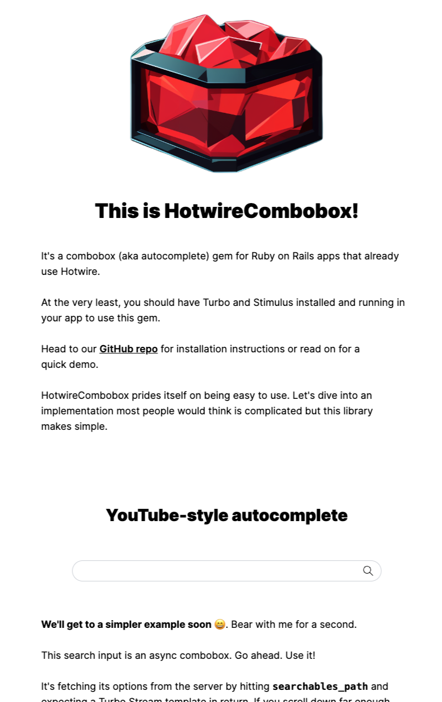

<p align="center">
  
</p>

# Easy Autocomplete for Ruby on Rails

[](https://github.com/josefarias/hotwire_combobox/actions/workflows/ci_tests.yml) [](https://badge.fury.io/rb/hotwire_combobox)


> [!IMPORTANT]
> We need your help to finalize this gem's first major release. Please use it in your apps and report any issues.

## Installation

Add this line to your application's Gemfile and run `bundle install`:

```ruby
gem "hotwire_combobox"
```

## Docs

<p align="center">
  
</p>

Visit [the docs site](https://hotwirecombobox.com/) for a demo and detailed documentation.
If the site is down, you can run the docs locally by cloning [the docs repo](https://github.com/josefarias/hotwire_combobox_docs).

## Contributing

Please read [CONTRIBUTING.md](./CONTRIBUTING.md).

## License

The gem is available as open source under the terms of the [MIT License](https://opensource.org/licenses/MIT).
